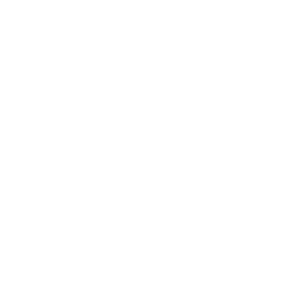

<div align="center">
    
    <br>
    <strong>Decentralized fitness social media app built on Lens Protocol 🌿</strong>
</div>
<br>

## 🌿 About Sparta-Lens-ETHNYC

Sparta-Lens-ETHNYC is a decentralized fitness social media app built with [Lens Protocol](http://lens.dev/) 🌿 and forked from Lenster [(lenster.xyz)](https://lenster.xyz/) during the ETHNYC 2022 hackathon. The goal was to simply filter for sparta-only posts and test the concept using a previously built out social media app on Lens. The full scale build will be built from scratch.

## ⚙️ Setup

### Using Local Environment

```sh
cp .env.example .env
yarn
yarn dev
```

and visit http://localhost:4783
